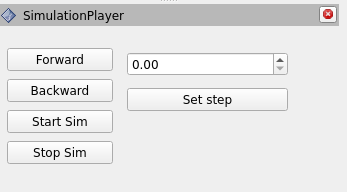

simulation_player
=================

This package provides a graphical interface to simulate time advancement when running
the plugins provided. The graphical interface is implemented as an rviz2 panel.

Building
--------

Place the package in the `remap_ws/src`; then, from `remap_ws`

`$ rosdep init`

`$ rosdep update`

`$ rosdep install --from-paths src/simulation_player`

`$ colcon build --packages-select simulation_player`

Usage
-----

Be sure you have source the correct `setup.bash` before playing with the simulation player!

This tool is meant as part of the `reMap` framework. It implements an rviz2 panel exposing the
commands to control the execution of the demo. The user can either decide to let the plugins
publish their information according to their rate or to stop the execution and advance, when 
desired, forward in time by a custom time step.

In order to add the panel, open the `panel` menu in the rviz2 top bar, select `Add new panel`
and among all the available panels proceed with `SimulationPlayer` from the `simulation_player`
package. The panel will appear on the bottom of the left column: use the pointer to enlarge it.

The interface offers five different buttons:
- `Start Sim` stops the natural execution of the plugins, starting the simulation mode;
- `Set Step` sets the simulation step size, that is, the amount of time you request to advance
	to the simulation by clicking on `Forward`;
- `Forward` executes a simulation step;
- `Backward` executes a reversed simulation step;
- `Stop Sim` leaves simulation mode, going back to the default execution mode for the plugins.